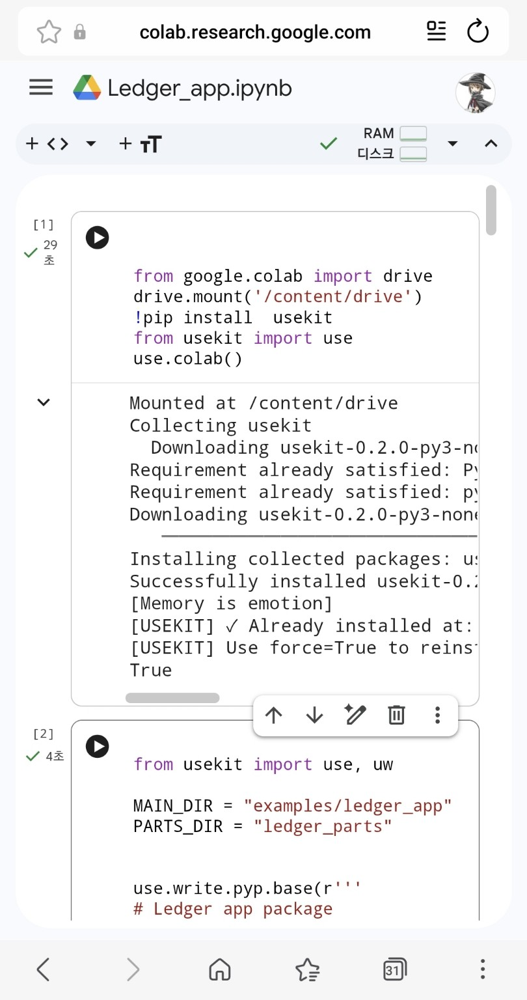
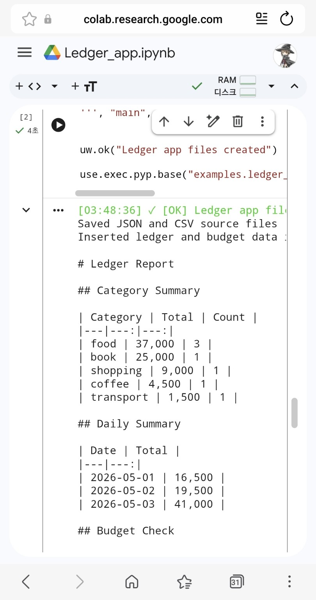

# Mobile Colab Ledger App Example

This example shows that USEKIT is **not tied to Termux**.

The same location-based workflow can also run in **mobile Google Colab** with Google Drive as the project workspace.

```text
Mobile Colab  = cloud Python runtime
Google Drive  = project storage
USEKIT        = location-based project layer
```

The goal of this example is simple:

> Turn mobile Colab from a temporary notebook into a reusable project workspace.

---

## What This Example Demonstrates

| Feature | Purpose |
|---|---|
| `drive.mount()` | Connect Google Drive as persistent project storage |
| `pip install usekit` | Install USEKIT in the Colab runtime |
| `use.colab()` | Prepare USEKIT for Colab + Drive usage |
| `use.write.pyp.base()` | Create the ledger app entry point |
| `use.write.pyp.sub()` | Create reusable ledger modules |
| `use.imp.pyp.sub()` | Connect `base` main with `sub` modules |
| `use.exec.pyp.base()` | Run the generated ledger app |
| JSON / CSV / SQLite / TXT outputs | Save generated results as project files |

---

## Colab Setup Cell

Run this first in mobile Google Colab:

```python
from google.colab import drive
drive.mount("/content/drive")

!pip install usekit

from usekit import use
use.colab()
```

This mounts Google Drive, installs USEKIT, and prepares the Colab project workspace.

---

## Run the Ledger App Builder

After setup, run the existing ledger app builder:

```text
examples/ledger_app/ledger_app_builder.py
```

The builder creates the app modules:

```text
src/base/examples/ledger_app/main.py
src/sub/ledger_parts/data.py
src/sub/ledger_parts/db.py
src/sub/ledger_parts/report.py
```

Then it runs the generated app with:

```python
use.exec.pyp.base("examples.ledger_app.main")
```

---

## Minimal Colab Runner

If the ledger app has already been generated in the USEKIT project, run:

```python
from usekit import use

use.exec.pyp.base("examples.ledger_app.main")
```

---

## Generated Project Result

After running the builder, the project can contain:

```text
<project>/
├── src/
│   ├── base/
│   │   └── examples/
│   │       └── ledger_app/
│   │           ├── __init__.py
│   │           └── main.py
│   │
│   └── sub/
│       └── ledger_parts/
│           ├── __init__.py
│           ├── data.py
│           ├── db.py
│           └── report.py
│
└── data/
    ├── json/
    ├── common/
    └── table/
```

The generated files are real project files in Google Drive, not temporary notebook-only output.

---

## Output Example

The ledger app prints a Markdown-style report:

```text
# Ledger Report

## Category Summary

| Category | Total | Count |
|---|---:|---:|
| food | 37,000 | 3 |
| book | 25,000 | 1 |
| shopping | 9,000 | 1 |
| coffee | 4,500 | 1 |
| transport | 1,500 | 1 |

## Daily Summary

| Date | Total |
|---|---:|
| 2026-05-01 | 16,500 |
| 2026-05-02 | 19,500 |
| 2026-05-03 | 41,000 |
```

---

## Snapshot

### 1. Colab setup

Drive mount, USEKIT installation, and `use.colab()` initialization.



### 2. Colab run

The generated ledger app running in mobile Colab.



---

## Why This Matters

Standard Colab is often used as a temporary notebook.

With USEKIT, Colab can become a project workspace:

- source files are generated into a project structure
- outputs are saved as project files
- Google Drive keeps the files after runtime reset
- the same location-based commands work across Termux and Colab

In short:

```text
Termux       = local mobile workspace
Mobile Colab = cloud runtime
Google Drive = persistent project storage
USEKIT       = location-based project workflow
```

This example demonstrates that USEKIT is a portable project layer, not a Termux-only workflow.
