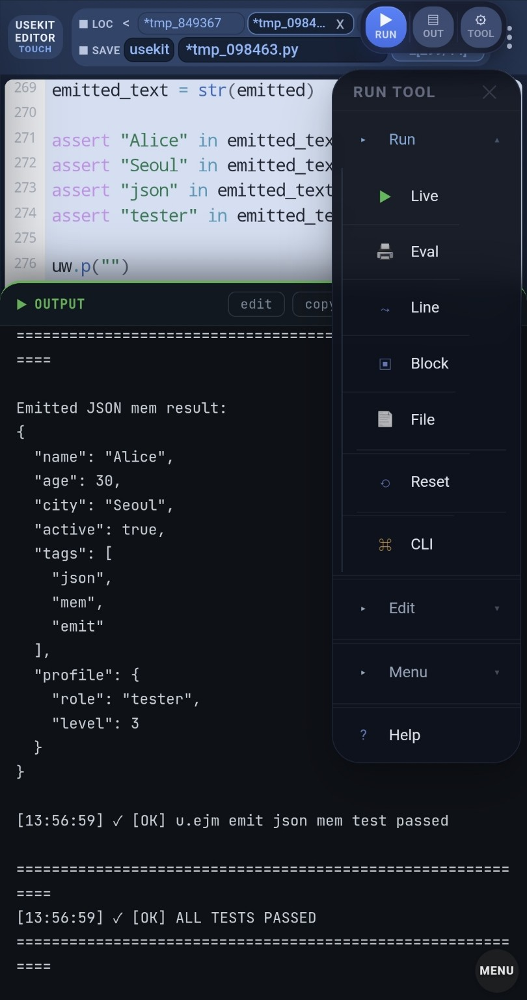

# JSON Append and Emit Demo

A compact USEKIT example for testing JSON append modes and memory-only JSON emit.

This example demonstrates:

- JSONL append
- array append
- object merge
- auto append mode detection
- `u.ejm()` memory JSON emit
- automatic emit handling for dict, list, and scalar values

---

## Key Idea

USEKIT can write, append, read, and emit JSON with short location-based commands.

```python
u.wjb(data, "name")
u.rjb("name")
u.ejm(data)
```

`u.ejm()` means:

```text
emit json mem
```

It serializes data in memory without writing a file.

---

## Emit Is Not Just `json.dumps`

`emit` is USEKIT's memory serialization layer.

It accepts common Python values such as:

- `dict`
- `list`
- `str`
- `int`
- `float`
- `bool`
- `None`
- nested structures

That makes it useful for:

- API payloads
- LLM request bodies
- prompt context
- log output
- preview strings
- tool-call style results

In short:

```text
write = persist data to a file
emit  = serialize data for transfer or preview
```

---

## Current Note

The stable short alias is:

```python
u.ejm(data)
```

The planned full semantic form is:

```python
use.emit.json.mem(data)
```

In the current release, the full semantic form may not be available while the `emit` branch is being restored in the full-name router.

Use `u.ejm()` for now.

---

## What This Example Tests

| Test | Purpose |
|---|---|
| JSONL append | Append multiple JSON objects as JSONL |
| Array append | Append objects into a JSON array |
| Object merge | Merge JSON objects |
| Auto mode | Detect append mode automatically |
| Emit JSON mem | Serialize values in memory with `u.ejm()` |
| Dict/List/Scalar emit | Verify flexible input handling |

---

## Run

Open `json_append_emit_demo.py` in USEKIT Editor and press **RUN**.

Or run it with USEKIT:

```python
from usekit import u

u.xpb("examples.json_append_emit.json_append_emit_demo")
```

---

## Output

The final output should include:

```text
Test 5: Emit JSON Mem

Emitted JSON mem result:
{
  "name": "Alice",
  "age": 30,
  "city": "Seoul",
  "active": true,
  "tags": [
    "json",
    "mem",
    "emit"
  ],
  "profile": {
    "role": "tester",
    "level": 3
  }
}

[OK] u.ejm emit json mem test passed
[OK] ALL TESTS PASSED
```

---

## Snapshot

The output shows all JSON append tests passing, then prints emitted JSON memory results.



---

## Summary

This example shows the difference between file-based JSON operations and memory-only JSON emit.

```text
u.wjb() = write json base
u.rjb() = read json base
u.ejm() = emit json mem
```

Core test operations use `u.*`.

Cleanup uses `s.*`, the safe wrapper layer.
