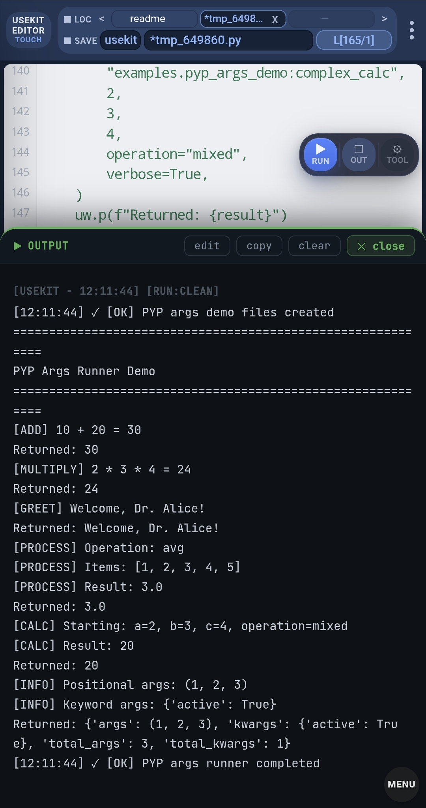

# PYP Args Demo

A compact USEKIT example for executing Python functions with positional arguments, keyword arguments, list arguments, and flexible `*args` / `**kwargs`.

This example focuses on one idea:

```python
use.exec.pyp.base("module:function", *args, **kwargs)
```

A normal Python function can be called through a USEKIT location-based module path.

---

## Quick Start

Open `pyp_args_builder.py` in USEKIT Editor and press **RUN**.

Or run it through USEKIT after placing it under your `base` location:

```python
from usekit import use

use.exec.pyp.base("examples.pyp_args.pyp_args_builder")
```

The builder creates two generated modules and then runs the generated runner.

---

## Generated File Structure

After running the builder, USEKIT creates:

```text
src/base/
└── examples/
    ├── pyp_args_demo.py      # target module with normal Python functions
    └── pyp_args_runner.py    # runner module using use.exec.pyp.base()
```

---

## Key Idea

The target module defines normal Python functions:

```python
def add(a, b):
    return a + b
```

USEKIT can execute that function by location-based module path and function name:

```python
use.exec.pyp.base("examples.pyp_args_demo:add", 10, 20)
```

This means:

```text
Run add(10, 20) from src/base/examples/pyp_args_demo.py
```

---

## Example Calls

```python
use.exec.pyp.base("examples.pyp_args_demo:add", 10, 20)

use.exec.pyp.base("examples.pyp_args_demo:multiply", 2, 3, z=4)

use.exec.pyp.base(
    "examples.pyp_args_demo:greet",
    "Alice",
    title="Dr.",
    greeting="Welcome",
)

use.exec.pyp.base(
    "examples.pyp_args_demo:process_list",
    [1, 2, 3, 4, 5],
    operation="avg",
)

use.exec.pyp.base(
    "examples.pyp_args_demo:complex_calc",
    2,
    3,
    4,
    operation="mixed",
    verbose=True,
)

use.exec.pyp.base(
    "examples.pyp_args_demo:show_info",
    1,
    2,
    3,
    mode="debug",
    active=True,
)
```

---

## What This Example Shows

| Feature | Example |
|---|---|
| Positional args | `add(10, 20)` |
| Keyword args | `multiply(2, 3, z=4)` |
| List argument | `process_list([1, 2, 3, 4, 5])` |
| Mixed args | `complex_calc(2, 3, 4, operation="mixed")` |
| `*args` / `**kwargs` | `show_info(1, 2, 3, mode="debug")` |

---

## Snapshot

The output shows each function call and its returned value.



---

## Summary

This example shows that USEKIT can execute a function inside a Python module directly by location-based module path:

```python
use.exec.pyp.base("examples.pyp_args_demo:function_name", *args, **kwargs)
```

It is useful for:

- small test modules
- reusable utilities
- LLM-generated function runners
- quick function-level execution checks
