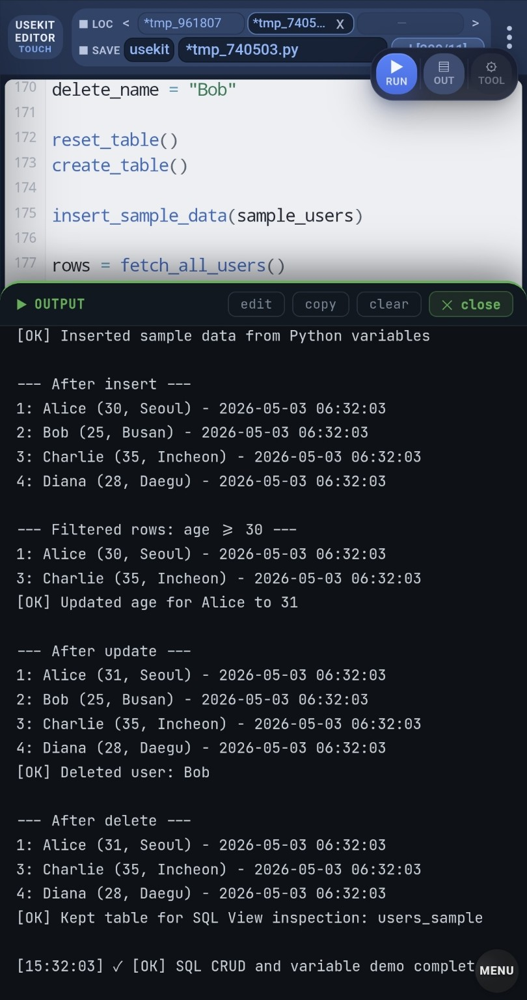
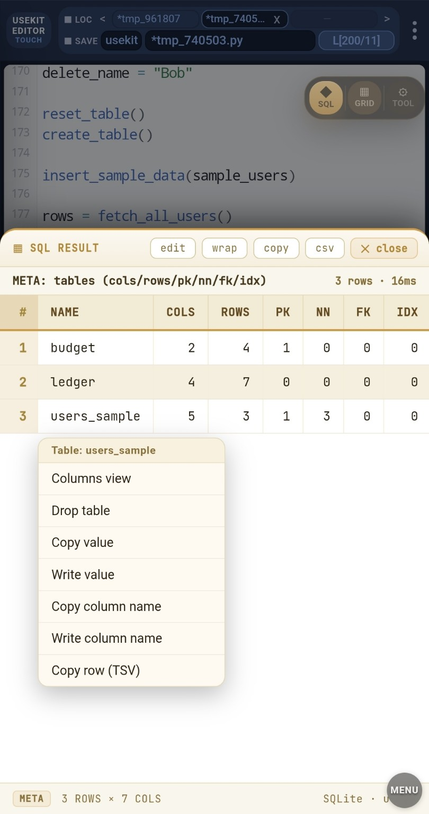

# SQL CRUD and Variable Demo

A compact USEKIT example for running SQLite CRUD operations with Python variables.

This example demonstrates:

- DROP / CREATE table
- INSERT rows from Python data
- SELECT all rows
- SELECT with filter variables
- UPDATE with Python variables
- DELETE with Python variables
- keeping the table for SQL View inspection

---

## Key Idea

USEKIT can execute SQLite statements with simple commands:

```python
u.xdb(sql_ddl)
u.xsb(sql_query)
```

This example keeps the SQL readable while showing how Python variables can drive SQL operations.

```python
min_age = 30
rows = u.xsb(f"""
SELECT id, name, age, city
FROM users_sample
WHERE age >= {int(min_age)}
""")
```

---

## What This Example Tests

| Step | Purpose |
|---|---|
| Reset | Drop the previous demo table |
| Create | Create `users_sample` |
| Insert | Insert rows from Python data |
| Select | Fetch all rows |
| Filter | Use a Python variable in `WHERE` |
| Update | Update Alice's age with Python variables |
| Delete | Delete Bob with a Python variable |
| Inspect | Keep the table for SQL View |

---

## Run

Open `sql_crud_variable_demo.py` in USEKIT Editor and press **RUN**.

Or run it with USEKIT:

```python
from usekit import u

u.xpb("examples.sql_crud_variable.sql_crud_variable_demo")
```

---

## Output

The output shows the full CRUD flow:

```text
[OK] Inserted sample data from Python variables

--- After insert ---
1: Alice (30, Seoul)
2: Bob (25, Busan)
3: Charlie (35, Incheon)
4: Diana (28, Daegu)

--- Filtered rows: age >= 30 ---
1: Alice (30, Seoul)
3: Charlie (35, Incheon)

[OK] Updated age for Alice to 31

--- After update ---
1: Alice (31, Seoul)
2: Bob (25, Busan)
3: Charlie (35, Incheon)
4: Diana (28, Daegu)

[OK] Deleted user: Bob

--- After delete ---
1: Alice (31, Seoul)
3: Charlie (35, Incheon)
4: Diana (28, Daegu)

[OK] Kept table for SQL View inspection: users_sample
[OK] SQL CRUD and variable demo completed
```

---

## SQL View Inspection

By default, this example keeps the `users_sample` table.

```python
DROP_AT_END = False
```

That allows you to inspect the table in USEKIT Editor SQL View after running the demo.

Expected remaining rows:

| id | name | age | city |
|---:|---|---:|---|
| 1 | Alice | 31 | Seoul |
| 3 | Charlie | 35 | Incheon |
| 4 | Diana | 28 | Daegu |

If you want the demo to clean up the table at the end, change:

```python
DROP_AT_END = True
```

---

## Safety Note

This demo uses simple string building for readability.

For real user input, parameter binding is safer when available.

This example is meant to demonstrate the workflow, not to be a SQL injection security guide.

---

## Snapshot

### Output panel

The output panel shows INSERT, SELECT, FILTER, UPDATE, and DELETE results.



### SQL View

The SQL View confirms that `users_sample` remains in the database for inspection.



---

## Summary

This example shows a compact SQLite workflow:

```text
Python variables
→ SQL statements
→ USEKIT execution
→ output panel
→ SQL View inspection
```

It is a simple SQL companion example for the larger `ledger_app` example.
